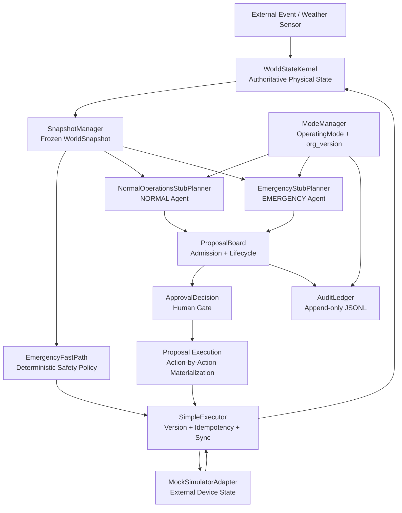
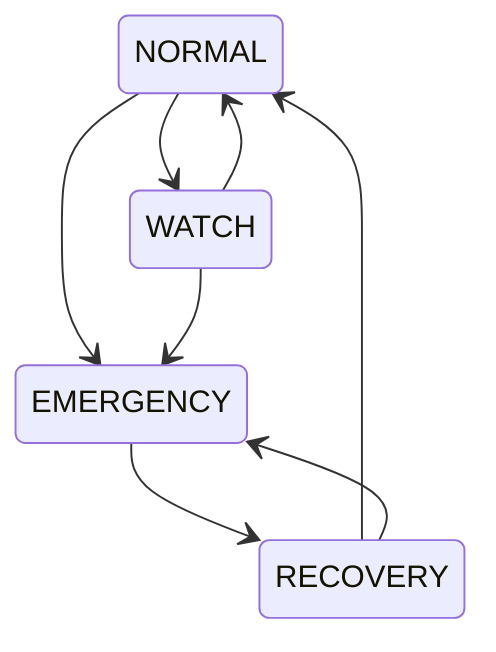
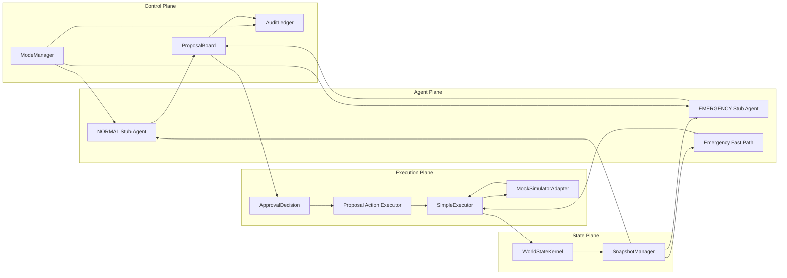
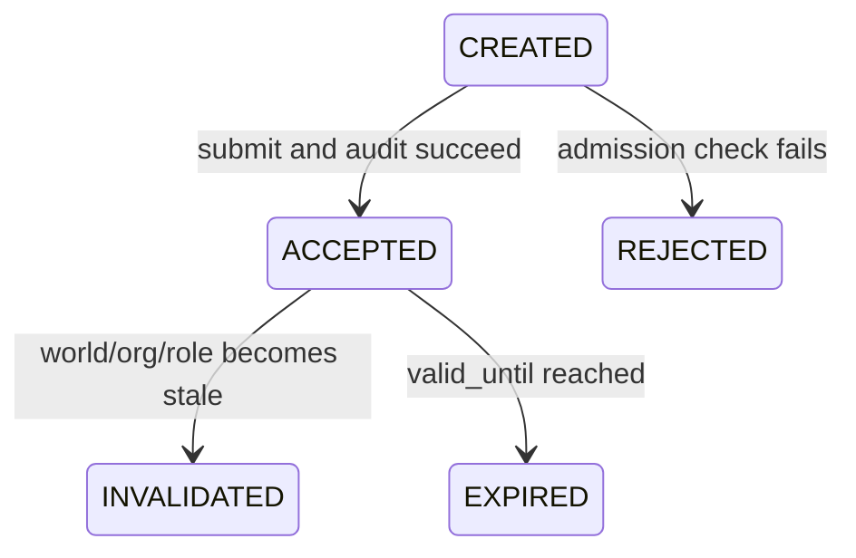
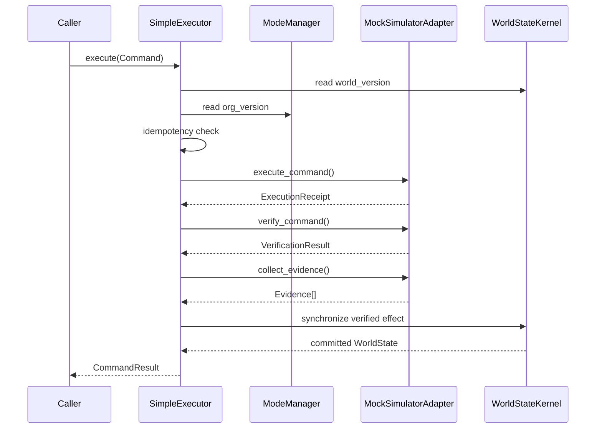
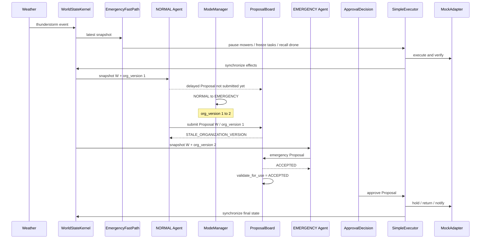

# Golf Runtime Core 架构说明

## 1. 项目定位

`golf-runtime-core` 是一个面向动态物理环境的多智能体运行时核心。当前实现以高尔夫球场雷暴应急为演示场景，解决以下问题：

- 物理世界状态持续变化时，Agent 的规划结果可能在返回前失效。
- 组织模式变化后，旧组织生成的 Proposal 不能继续执行。
- 安全事件需要绕过慢速规划链，优先执行确定性 Fast Path。
- 外部设备执行成功并不等于 Runtime 已同步成功，两者必须分别验证和记录。
- Proposal、Command、世界版本和组织版本需要可审计、可复核和可幂等执行。

当前项目是纯 Python 3.9 本地运行时，不连接网络模型、FastAPI、Isaac Sim 或真实机器人。

## 2. 总体架构



## 3. 分层结构

| 层 | 目录 | 主要职责 |
|---|---|---|
| Schema 层 | `runtime_core/schemas` | 定义 frozen 数据契约、状态模型和序列化边界 |
| World 层 | `runtime_core/world` | 管理权威物理状态、世界版本和不可变快照 |
| Organization 层 | `runtime_core/organization` | 管理运行模式、组织版本、角色激活和切换 |
| Coordination 层 | `runtime_core/coordination` | Proposal 准入、去重、版本检查和生命周期失效 |
| Policy 层 | `runtime_core/policies` | 无模型依赖的确定性安全策略 |
| Execution 层 | `runtime_core/execution` | Command 执行、幂等、验证、证据和 Kernel 同步 |
| Adapter 层 | `runtime_core/adapters` | 模拟外部设备真实状态，实现 SimulatorAdapter |
| Audit 层 | `runtime_core/audit` | 追加式 JSONL 审计记录和校验 |
| Port 层 | `runtime_core/ports` | Planner、模型路由和 Simulator 的抽象接口 |
| Demo 层 | `runtime_core/demo` | Stub Agent 与雷暴端到端编排 |

## 4. 完整目录结构

```text
golf-runtime-core/
├── ARCHITECTURE.md
├── runtime_core/
│   ├── __init__.py
│   ├── adapters/
│   │   ├── __init__.py
│   │   └── mock_adapter.py
│   ├── audit/
│   │   ├── __init__.py
│   │   └── ledger.py
│   ├── coordination/
│   │   ├── __init__.py
│   │   └── proposal_board.py
│   ├── demo/
│   │   ├── __init__.py
│   │   ├── stub_planners.py
│   │   └── thunderstorm_demo.py
│   ├── errors/
│   │   ├── __init__.py
│   │   └── proposal_errors.py
│   ├── execution/
│   │   ├── __init__.py
│   │   ├── proposal_execution.py
│   │   └── simple_executor.py
│   ├── organization/
│   │   ├── __init__.py
│   │   ├── mode_manager.py
│   │   └── org_transition.py
│   ├── policies/
│   │   ├── __init__.py
│   │   └── emergency_fast_path.py
│   ├── ports/
│   │   ├── __init__.py
│   │   ├── model_router.py
│   │   ├── planner.py
│   │   └── simulator.py
│   ├── schemas/
│   │   ├── __init__.py
│   │   ├── approval.py
│   │   ├── audit.py
│   │   ├── commands.py
│   │   ├── events.py
│   │   ├── evidence.py
│   │   ├── organization.py
│   │   ├── proposals.py
│   │   └── world_state.py
│   └── world/
│       ├── __init__.py
│       ├── snapshot_manager.py
│       ├── state_kernel.py
│       └── version_manager.py
└── tests/
    ├── test_audit_ledger.py
    ├── test_command_schema.py
    ├── test_emergency_fast_path.py
    ├── test_mock_adapter.py
    ├── test_mode_manager.py
    ├── test_org_transition.py
    ├── test_proposal_board.py
    ├── test_proposal_execution.py
    ├── test_proposal_schema.py
    ├── test_simple_executor.py
    ├── test_snapshots.py
    ├── test_stale_organization_proposal.py
    ├── test_stub_planners.py
    ├── test_thunderstorm_demo.py
    └── test_world_state.py
```

## 5. 状态与版本所有权

系统坚持单一写入者原则，避免同一个版本或状态被多个模块独立修改。

| 权威状态 | 唯一所有者 | 读取者 | 更新规则 |
|---|---|---|---|
| `WorldState` | `WorldStateKernel` | Snapshot、Board、Executor、Policy | 真实变化时 `world_version + 1` |
| `OperatingMode` | `ModeManager` | Planner、Board、Executor | 合法模式变化时 `org_version + 1` |
| Proposal 生命周期 | `ProposalBoard` 中的 `StoredProposal` | 审批、执行编排 | 原始 Proposal 永远保持 `CREATED` |
| 外部模拟设备状态 | `MockSimulatorAdapter` | `SimpleExecutor` | Adapter 执行命令后改变 |
| Command 执行结果 | `SimpleExecutor` | Fast Path、Proposal Execution、Demo | 独立 `CommandResult`，不修改原 Command |
| 审计记录 | `AuditLedger` | Demo、测试、运维读取者 | append-only JSONL |

三个重要版本/状态边界：

```text
WorldStateKernel  owns world_version
ModeManager       owns org_version and OperatingMode
ProposalBoard     owns StoredProposal.current_status
```

## 6. 多智能体组织架构

### 6.1 当前角色全集

```text
supervisor
safety
operations
maintenance
resource
communication
incident_commander
logistics
turf_optimizer
cost_optimizer
daily_scheduler
```

`active_roles` 与 `suspended_roles` 不重叠，二者并集始终等于 `registered_roles`。角色不会在组织切换过程中消失。

### 6.2 模式与活跃角色

| 模式 | 组织负责人 | 当前活跃角色 |
|---|---|---|
| `NORMAL` | `supervisor` | supervisor, safety, operations, maintenance, resource, communication |
| `WATCH` | `supervisor` | supervisor, safety, operations, maintenance, resource, communication |
| `EMERGENCY` | `incident_commander` | incident_commander, safety, operations, logistics, communication |
| `RECOVERY` | `incident_commander` | incident_commander, safety, operations, maintenance, logistics, communication |

### 6.3 合法模式转换



非法转换会写拒绝审计并抛出异常。相同模式请求为 no-op，不增加 `org_version`，也不改变 `activated_at` 或 `transition_id`。

### 6.4 已实现 Agent 与角色槽位的区别

当前代码中已实现并可运行的 Agent/决策组件：

| 组件 | 类型 | 使用角色 | 行为 |
|---|---|---|---|
| `NormalOperationsStubPlanner` | 确定性 Stub Agent | operations | 在 NORMAL/WATCH 生成日常割草 Proposal |
| `EmergencyStubPlanner` | 确定性 Stub Agent | incident_commander | 在 EMERGENCY 生成保持、回库和通知 Proposal |
| `EmergencyFastPath` | 确定性安全策略 | 不依赖 Planner | 雷暴时立即暂停设备、召回无人机、冻结任务 |

`safety`、`maintenance`、`logistics`、`communication` 等目前是组织角色槽位，还没有各自独立的 LLM Agent 实现。`ModelRouterPort` 也是未来模型集成边界，当前没有连接 Step 3.7 或外部模型。

## 7. Agent 控制面与执行面



## 8. 核心数据模型

### 8.1 World State

`WorldState` 包含：

- zones
- people
- machines
- tasks
- routes
- weather
- resource reservations
- `new_tasks_frozen`
- `world_version`
- UTC timestamp

`SnapshotManager` 将其转换为深度不可变的 `FrozenWorldState` 和 `WorldSnapshot`。Planner 只能读取 Snapshot，不能修改权威世界。

### 8.2 Proposal

Proposal 是 Agent 对未来动作的建议，不是可执行命令。

```text
Proposal
├── proposal_id / epoch_id
├── agent_id / agent_role
├── world_version / org_version
├── actions: tuple[ProposalAction, ...]
├── resource_claims
├── confidence / rationale_summary
├── created_at / valid_until
└── status = CREATED
```

原始 `Proposal.status` 始终为 `CREATED`。生命周期由 Board 内部的 `StoredProposal.current_status` 管理。



ProposalBoard 的准入检查包括：

1. duplicate proposal ID
2. world version
3. organization version
4. expiration
5. active role

已接受 Proposal 在执行前通过 `validate_for_use()` 显式复核。普通 `get()` 和 list 接口不会隐式改变生命周期。

### 8.3 Command

Command 是绑定当前版本、可以交给 Adapter 的单条执行指令。

```text
Command
├── command_id
├── incident_id
├── idempotency_key
├── command_type / target_id / parameters
├── source
├── world_version / org_version
├── status = CREATED
└── created_at
```

支持的命令：

- `pause_machine`
- `hold_position`
- `return_to_base`
- `recall_drone`
- `freeze_new_tasks`
- `notify_operator`

幂等键固定为：

```text
{incident_id}:{command_type}:{target_id}
```

同一个 incident 的相同动作不会重复执行，新 incident 可以再次向同一设备发送命令。

## 9. 单条 Command 执行链



状态边界：

- MockAdapter 模拟外部设备真实状态。
- WorldStateKernel 是 Runtime 的权威状态。
- 只有 SimpleExecutor 可以完成 Adapter 到 Kernel 的同步链。
- Fast Path 和 Planner 不能直接修改 Adapter 内部状态，也不能绕过 Kernel。

如果 Adapter 已执行但 Kernel 同步失败：

- CommandResult 返回 `UNKNOWN`，不返回 `VERIFIED`。
- message 包含 `ADAPTER_EXECUTED_KERNEL_SYNC_FAILED`。
- Evidence 同时保存 Adapter 结果和 Kernel 同步错误。
- 当前版本不执行复杂回滚。

## 10. Proposal 多 Action 执行

`execute_approved_proposal()` 只在执行开始前调用一次 `ProposalBoard.validate_for_use()`。之后逐条物化 Command：

1. 保存执行开始时的 `execution_org_version`。
2. 每条 Action 前读取当前 OrganizationState。
3. 如果 `org_version` 已变化，停止剩余动作。
4. 读取最新 `world_version`。
5. 将当前 Action 转换成一条 Command。
6. 调用 SimpleExecutor。
7. Command 为 `FAILED` 或 `UNKNOWN` 时 fail-stop。

不能预先批量生成所有 Command，因为前一条 Command 可能主动改变 `world_version`。

## 11. 雷暴端到端流程



关键时序保证：NORMAL Proposal 在 Fast Path 完成后创建；组织切换后、旧 Proposal 提交前不再修改 WorldState。因此：

```text
proposal.world_version == current.world_version
proposal.org_version   != current.org_version
```

拒绝原因稳定为 `STALE_ORGANIZATION_VERSION`，而不是 `STALE_WORLD_VERSION`。

## 12. 雷暴 Demo 最终状态

自动批准时：

| 对象 | 最终状态 |
|---|---|
| mower_1 | `holding`，保持在 zone_B |
| mower_2 | `idle`，位于 maintenance_base |
| drone_1 | `idle`，位于 maintenance_base |
| new tasks | frozen |
| organization | EMERGENCY / org_version 2 |

拒绝人工审批时：

- Emergency Proposal 仍然可以被接受。
- 不执行后续 hold/return/notify Actions。
- mower_1 和 mower_2 保持 Fast Path 产生的 paused 状态。
- drone_1 已由 Fast Path 召回。
- 系统仍处于 EMERGENCY，且新任务保持冻结。

## 13. 审计架构

AuditLedger 是带 checksum 的 append-only JSONL 文件。当前记录类型包括：

- `ORGANIZATION_TRANSITION`
- `ORGANIZATION_TRANSITION_REJECTED`
- `ORGANIZATION_TRANSITION_NO_OP`
- `PROPOSAL_ACCEPTED`
- `PROPOSAL_REJECTED`
- `PROPOSAL_INVALIDATED`

组织切换与 Proposal 生命周期都采用“先写 Ledger，后发布内存状态”的顺序。Ledger 失败时：

- 组织状态不切换。
- Proposal 不接受、不拒绝、不失效。
- proposal ID 不会因失败审计而被占用。

这是单进程内存状态与本地 JSONL Ledger 的一致性边界，不声称是分布式事务。

## 14. 关键安全不变量

1. WorldState 只能由 WorldStateKernel 提交。
2. OperatingMode 和 org_version 只能由 ModeManager 分配。
3. 原始 Proposal 和 Command 都是 frozen，状态变化保存在独立结果模型。
4. 所有关键 datetime 必须 timezone-aware，并规范化到 UTC。
5. 非法更新、重复事件、no-op 都不能错误增加 world_version。
6. Ledger append 失败不能发布对应组织或 Proposal 状态。
7. 旧 world/org version 的 Command 不能到达 Adapter。
8. 同 incident 的同逻辑 Command 只执行一次。
9. Adapter 已执行但 Kernel 同步失败时必须返回 UNKNOWN。
10. 公开读取接口不返回内部可变容器引用。

## 15. 测试结构

当前测试覆盖：

- WorldState 原子更新、版本规则、事件去重
- Frozen Snapshot 深度不可变和 JSON 往返
- 模式转换矩阵、角色不变量和 Ledger 失败边界
- Proposal Schema、准入、重复 ID 和显式失效
- Command/Evidence Schema 和 UTC 规则
- MockAdapter 命令、失败与无回传
- SimpleExecutor 版本检查、幂等和同步失败
- Emergency Fast Path 最终安全状态
- Stub Planner 模式约束和版本绑定
- Approval、逐 Action 最新版本执行和 fail-stop
- 雷暴 Demo 自动批准与拒绝路径

完整测试命令：

```bash
cd /Users/zhiqihao/Documents/DGX/golf-runtime-core
python3 -m pytest -q
```

当前基线为 `108 passed`。

## 16. 运行 Demo

自动批准：

```bash
python3 -m runtime_core.demo.thunderstorm_demo
```

拒绝后续动作：

```bash
python3 -m runtime_core.demo.thunderstorm_demo --reject
```

CLI 会明确输出：

```text
ORGANIZATION SWITCHED: org_version 1 -> 2
OLD PROPOSAL REJECTED: STALE_ORGANIZATION_VERSION
EMERGENCY PROPOSAL ACCEPTED
HUMAN APPROVAL: APPROVED or REJECTED
```

## 17. 当前未实现的边界

以下能力仍是未来扩展，不属于当前代码现状：

- Step 3.7 或其他 LLM/VLM Agent 调用
- DGX/vLLM 模型服务连接
- Isaac Sim 或真实机器人连接
- FastAPI 和网络服务
- CapabilityRegistry
- PolicyVersionProvider
- 复杂 PlanComposer 和 ConflictResolver
- 多级人工审批
- 分布式事务和恢复协议
- 动态组织搜索算法

这些扩展应通过现有 Port、Proposal、Command 和版本所有权边界接入，而不绕过 WorldStateKernel、ModeManager、ProposalBoard 或 SimpleExecutor。
