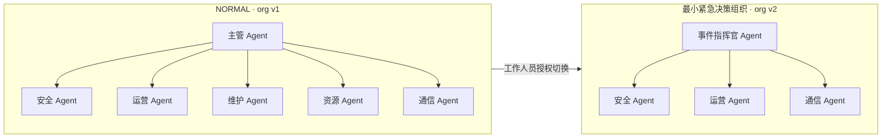
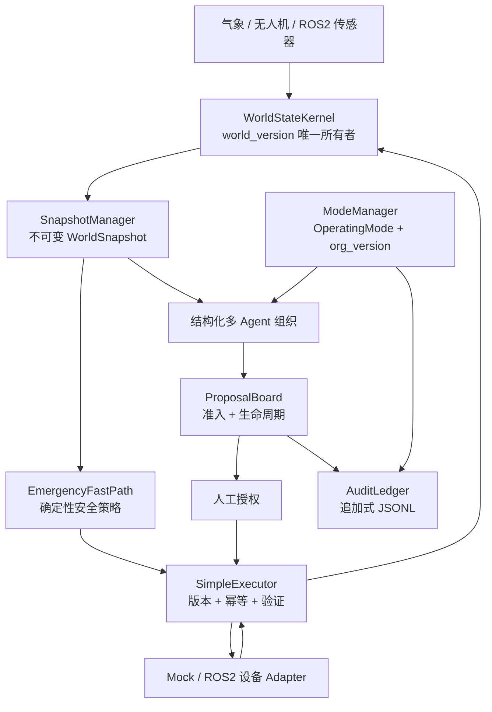

# dynamic agent of physical AI

> **Athena · NVIDIA DGX Spark 黑客松**
>
> 一个能在物理世界变化导致计划失效之前，动态重构多 Agent 组织的运行时。

`golf-runtime-core` 是一个面向动态物理环境的多 Agent 运行时核心，用于协调 AI Agent、工作人员和物理设备。当前演示场景为高尔夫球场雷暴应急，包含自动割草机、巡检无人机和球场人员。

我们的核心创新是：

> **根据突发事件组建覆盖必要能力的最小 Agent 组织，在不减少安全检查的前提下降低协调延迟，帮助工作人员更快完成应急决策与处置。**

## 为什么需要 Athena

软件可以保存日志、重复测试，但物理世界无法暂停。

- 人员、设备、天气和路线在 Agent 规划期间仍会持续变化。
- 旧组织生成的 Proposal 可能已经失去执行权限。
- 紧急安全动作不能等待缓慢的模型规划链。
- 外部设备返回成功，不代表 Runtime 已经完成状态同步。
- 每个 Proposal、Command、组织转换和物理观测都必须可审计。

Athena 使用版本化世界状态、动态 Agent 组织、确定性安全策略、证据驱动执行和追加式审计解决这些问题。

## 演示场景

日常运行时，无人机在球场巡检，自动割草机在人员附近执行作业。当雷暴接近球场后：

1. 气象数据更新权威世界状态。
2. `EmergencyFastPath` 立即执行确定性安全动作。
3. Runtime 提出最小紧急组织建议。
4. 工作人员授权组织模式切换。
5. 审计成功后，`ModeManager` 原子执行 `NORMAL → EMERGENCY`。
6. 旧组织生成的 Proposal 被自动拒绝。
7. 安全、运营和通信 Agent 协作生成新的紧急 Proposal。
8. Command 被执行、验证、记录为 Evidence，并同步回 `WorldStateKernel`。

## 动态 Agent 组织



这不是更换 Prompt，而是一次带有明确角色、权限、版本和审计记录的组织转换。

## 协调延迟实验

我们使用相同 Agent 延迟和相同确定性安全快路径，对最小紧急决策组织与固定六角色组织进行了可复现的成对仿真。

| 指标 | 最小紧急组织 | 固定完整组织 | 改善 |
|---|---:|---:|---:|
| 决策角色 | 4 | 6 | Agent 调用减少 33.3% |
| Agent 消息 | 7 | 11 | 消息减少 36.4% |
| 协调延迟 P50 | 2.813 秒 | 4.240 秒 | 降低 33.7% |
| 协调延迟 P95 | 3.756 秒 | 5.376 秒 | 降低 30.1% |

10,000 轮成对仿真显示，从人工授权完成到 Proposal 形成的协调延迟平均降低 **33.4%**。

实验并不声称减少 Agent 可以让人员或设备移动得更快。首条紧急指令仍由确定性的 `EmergencyFastPath` 保证，测得的收益来自授权后减少不必要的 Agent 调用和通信。

## 系统架构



### 单一所有者边界

| 权威状态 | 唯一写入者 |
|---|---|
| 物理世界与 `world_version` | `WorldStateKernel` |
| 运行模式与 `org_version` | `ModeManager` |
| Proposal 生命周期 | `ProposalBoard` |
| Adapter 执行、验证、Evidence 与 Kernel 同步 | `SimpleExecutor` |

Agent 和模型不能直接修改物理世界，也不能绕过执行链控制设备。

## 双版本 Proposal

每个 `Proposal` 同时绑定：

```text
world_version
org_version
```

如果物理世界没有变化，但组织已经完成切换，旧 Proposal 会被拒绝：

```text
STALE_ORGANIZATION_VERSION
```

这可以防止在 `NORMAL` 权限下生成的决策进入 `EMERGENCY` 组织继续执行。

## 安全执行 Runtime

每条物理 Command 都必须通过一条受控执行链：

```text
版本检查
→ 幂等检查
→ Adapter 执行
→ 结果验证
→ Evidence 收集
→ WorldStateKernel 同步
```

如果 Adapter 执行成功，但 Kernel 状态同步失败，Runtime 返回：

```text
UNKNOWN
ADAPTER_EXECUTED_KERNEL_SYNC_FAILED
```

系统不会把未经验证的物理执行结果错误标记为 `VERIFIED`。

## 人员与路线安全

- 切换紧急组织必须经过工作人员明确授权。
- `ModeManager` 发布组织转换前，授权记录必须成功写入 `AuditLedger`。
- 无人机与人员至少保持 10 个球场坐标单位。
- 割草机与人员至少保持 8 个球场坐标单位。
- 不安全的路线会被调整、绕行或拒绝。
- 多 Agent 冲突按照明确的权限规则处理：

```text
SAFETY_VETO > MAINTENANCE_CLEARANCE > OPERATIONS_CONTINUITY
```

## 技术栈

- Python 3.9
- Pydantic Frozen Schema
- StepFun `step-3.7-flash` 模型 Adapter
- Mock 物理仿真器
- ROS2 传感器与设备 Adapter Port
- JSONL Runtime Trace 与 Audit Ledger
- 无后端框架依赖的 HTTP Dashboard
- Pytest 自动化测试

## 项目结构

```text
runtime_core/
├── adapters/       # Mock、StepFun 与 ROS2 边界
├── agents/         # Agent Harness、角色和结构化 Handler
├── audit/          # 追加式 Audit Ledger
├── coordination/   # Proposal 准入与生命周期
├── demo/           # 雷暴应急场景
├── execution/      # Command 与 Proposal 执行
├── organization/   # ModeManager 与组织转换
├── orchestration/  # 紧急多 Agent 消息编排
├── policies/       # 确定性安全策略
├── schemas/        # Frozen Runtime 数据契约
├── trace/          # Runtime Trace 导出
├── ui/             # 交互式运行控制台
└── world/          # WorldStateKernel 与 Snapshot
```

完整架构、状态所有权和安全不变量请查看 [ARCHITECTURE.md](ARCHITECTURE.md)。

## 运行演示

运行环境：Python 3.9，并已安装项目运行与测试依赖。

### 雷暴 CLI Demo

```bash
python3 -m runtime_core.demo.thunderstorm_demo
```

运行人工拒绝后续动作的分支：

```bash
python3 -m runtime_core.demo.thunderstorm_demo --reject
```

### 交互式控制台

```bash
python3 -m runtime_core.ui.server --port 8765
```

浏览器打开 [http://127.0.0.1:8765](http://127.0.0.1:8765)。

控制台默认使用 Mock 物理信号，支持日常巡检、灌溉故障、人员安全绕行、割草机任务指派、雷暴授权、紧急组织切换、位置持续验证和恢复日常运行。

### 可选 StepFun 模型

```bash
export STEP_API_KEY="your-api-key"
python3 -m runtime_core.ui.server --port 8765
```

API Key 不会写入 Schema、日志、Trace 或仓库。模型只接收只读 Runtime 投影，无法直接写入 `WorldStateKernel`、`ModeManager`、`ProposalBoard` 或 `SimpleExecutor`。

### 运行测试

```bash
python3 -m pytest -q
```

当前已提交 Runtime 基线包含 **178 项通过测试**，覆盖状态所有权、版本规则、Proposal 准入、组织切换、安全策略、执行证据、StepFun Schema 验证、ROS2 边界、Trace 导出和 UI 行为。

## 当前接入边界

当前物理世界使用 Mock 数据驱动。Isaac Sim、真实 ROS2 Node、硬件在环测试和分布式恢复属于后续接入能力。这些能力应通过现有 Port 接入，不能绕过 Runtime 的所有权、Policy、版本和 Evidence 边界。

`MinimalOrganizationSelector` 在没有物流约束时推荐上图所示的四角色决策组织。当前 `ModeManager` 的紧急模式仍将 `logistics` 保留为活跃预留角色，但它不参与本次测量的四角色决策链。统一这两个配置来源是已经记录的下一步工作。

## 项目愿景

Athena 从高尔夫球场开始，但这套 Runtime 架构也可以扩展到工厂、仓储、园区、农场等需要多个 Agent 与物理设备在动态环境中安全协作的场景。

> Physical AI Runtime 不仅要知道如何行动，还要知道**何时不该行动**。
