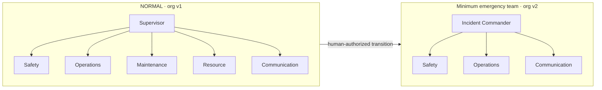
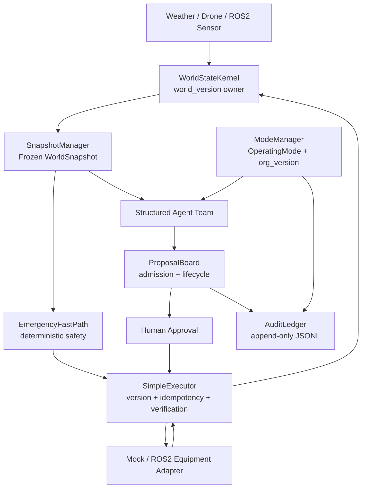

# dynamic agent of physical AI

> **Athena · NVIDIA DGX Spark Hackathon**
>
> A versioned multi-agent runtime that reorganizes itself before the physical world outruns the plan.

`golf-runtime-core` is a Python runtime for coordinating AI agents, humans, and physical equipment in a changing environment. The current demonstration uses a golf course thunderstorm, autonomous mowers, a patrol drone, and people on the course.

The core innovation is simple:

> **Use the smallest set of necessary agents to form the lowest-latency emergency organization, helping operators respond to incidents faster without removing safety checks.**

## Why this project

Software can save logs and rerun tests. The physical world cannot be paused.

- People, machines, weather, and routes keep changing while an agent is planning.
- A proposal created by an old organization may no longer have authority to execute.
- Emergency actions cannot wait for a slow model-planning loop.
- A device reporting success does not prove that the runtime synchronized the result.
- Every proposal, command, transition, and physical observation must remain auditable.

Athena addresses these problems with versioned world state, dynamic agent organizations, deterministic safety policies, evidence-backed execution, and append-only auditing.

## Demo scenario

During normal operation, a drone patrols the course while autonomous mowers work around players. When a thunderstorm approaches:

1. Weather telemetry updates the authoritative world state.
2. `EmergencyFastPath` immediately applies deterministic safety actions.
3. The runtime proposes the minimum emergency organization.
4. A human operator authorizes the mode transition.
5. `ModeManager` atomically switches `NORMAL → EMERGENCY` after audit succeeds.
6. Proposals created by the old organization are rejected.
7. Safety, operations, and communication agents produce a new emergency proposal.
8. Commands are executed, verified, recorded as evidence, and synchronized back to `WorldStateKernel`.

## Dynamic agent organization



This is not a prompt change. It is a validated organization transition with explicit roles, permissions, versions, and an audit record.

## Measured coordination result

A reproducible paired simulation compared the minimum emergency decision team with a fixed six-role organization under the same agent latency and the same deterministic safety fast path.

| Metric | Minimum emergency team | Fixed full team | Improvement |
|---|---:|---:|---:|
| Decision roles | 4 | 6 | 33.3% fewer calls |
| Agent messages | 7 | 11 | 36.4% fewer messages |
| Coordination latency P50 | 2.813 s | 4.240 s | 33.7% lower |
| Coordination latency P95 | 3.756 s | 5.376 s | 30.1% lower |

Across 10,000 paired runs, authorization-to-proposal coordination latency decreased by **33.4% on average**. The experiment does not claim that fewer agents make people or machines move faster. The first emergency instruction remains protected by the deterministic `EmergencyFastPath`; the measured benefit comes from reducing unnecessary coordination after authorization.

## Architecture



### Single-owner boundaries

| Authoritative state | Only writer |
|---|---|
| Physical world and `world_version` | `WorldStateKernel` |
| Operating mode and `org_version` | `ModeManager` |
| Proposal lifecycle | `ProposalBoard` |
| Adapter execution, verification, evidence, and kernel sync | `SimpleExecutor` |

Agents and models never write directly to the physical world or bypass the execution chain.

## Version-bound proposals

Every `Proposal` is bound to both:

```text
world_version
org_version
```

If the world is unchanged but the organization has transitioned, the old proposal is rejected with:

```text
STALE_ORGANIZATION_VERSION
```

This prevents a decision created under `NORMAL` authority from executing after the runtime enters `EMERGENCY`.

## Safe execution runtime

Every physical command follows one controlled path:

```text
version check
→ idempotency check
→ adapter execution
→ result verification
→ evidence collection
→ WorldStateKernel synchronization
```

If the adapter executes successfully but kernel synchronization fails, the runtime returns:

```text
UNKNOWN
ADAPTER_EXECUTED_KERNEL_SYNC_FAILED
```

The system never reports an unverified physical outcome as `VERIFIED`.

## Human and route safety

- Emergency organization changes require explicit human authorization.
- Authorization must be appended to `AuditLedger` before `ModeManager` publishes the transition.
- Drones keep at least 10 course-coordinate units from people.
- Mowers keep at least 8 course-coordinate units from people.
- Unsafe routes are adjusted, detoured, or rejected.
- Multi-agent conflicts follow explicit authority rules:

```text
SAFETY_VETO > MAINTENANCE_CLEARANCE > OPERATIONS_CONTINUITY
```

## Technology

- Python 3.9
- Pydantic frozen schemas
- StepFun `step-3.7-flash` model adapter
- Mock physical simulator
- ROS2 sensor and equipment adapter ports
- JSONL runtime trace and audit ledger
- Dependency-free HTTP dashboard
- Pytest regression suite

## Repository structure

```text
runtime_core/
├── adapters/       # Mock, StepFun, and ROS2 boundaries
├── agents/         # Agent harness, roles, and structured handlers
├── audit/          # Append-only audit ledger
├── coordination/   # Proposal admission and lifecycle
├── demo/           # Thunderstorm scenario
├── execution/      # Command and proposal execution
├── organization/   # ModeManager and organization transitions
├── orchestration/  # Emergency multi-agent messaging
├── policies/       # Deterministic safety policies
├── schemas/        # Frozen runtime contracts
├── trace/          # Runtime trace export
├── ui/             # Interactive operations dashboard
└── world/          # WorldStateKernel and snapshots
```

For the complete design and invariants, see [ARCHITECTURE.md](ARCHITECTURE.md).

## Run the demo

Requirements: Python 3.9 with the project's runtime and test dependencies available.

### Thunderstorm CLI

```bash
python3 -m runtime_core.demo.thunderstorm_demo
```

Run the human-rejected branch:

```bash
python3 -m runtime_core.demo.thunderstorm_demo --reject
```

### Interactive dashboard

```bash
python3 -m runtime_core.ui.server --port 8765
```

Open [http://127.0.0.1:8765](http://127.0.0.1:8765).

The dashboard starts with mock physical signals. It supports normal patrol, maintenance hazards, route-safe machine movement, thunderstorm authorization, emergency organization transition, continuously verified positions, and recovery to normal operation.

### Optional StepFun model

```bash
export STEP_API_KEY="your-api-key"
python3 -m runtime_core.ui.server --port 8765
```

The API key is never written to schemas, logs, traces, or the repository. The model receives a read-only runtime projection and has no direct write access to `WorldStateKernel`, `ModeManager`, `ProposalBoard`, or `SimpleExecutor`.

### Tests

```bash
python3 -m pytest -q
```

The committed runtime baseline contains **178 passing tests** covering state ownership, version rules, proposal admission, organization transitions, safety policies, execution evidence, StepFun schema enforcement, ROS2 boundaries, trace export, and UI behavior.

## Current integration boundary

The current physical world is mock-driven. Isaac Sim, live ROS2 nodes, hardware-in-the-loop testing, and distributed recovery are future integrations. They are expected to connect through the existing ports and must not bypass the runtime's ownership, policy, version, or evidence boundaries.

`MinimalOrganizationSelector` recommends the four-role decision team shown above when no logistics constraint exists. The current `ModeManager` emergency profile still keeps `logistics` active as a reserved role; it does not participate in the measured four-role decision chain. Unifying these two configuration sources is a documented next step.

## Vision

Athena begins with a golf course, but the runtime model applies to factories, warehouses, campuses, farms, and other environments where multiple agents and physical machines must adapt safely under changing conditions.

> A Physical AI runtime should know not only how to act, but also **when not to act**.
